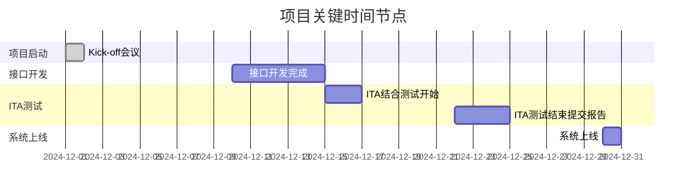
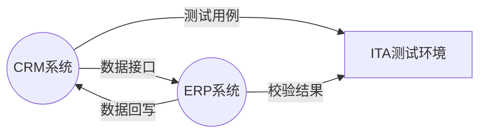

# 🚀 项目 Kick-off 会议重点内容

> 本文档适用于 IT 项目团队 Kick-off 会议，通过结构化、图表化方式明确会议各项重点内容。

---

## 1️⃣ 会议目的

- **明确项目启动的意义和目标**
- **统一团队认知，确保所有成员理解项目范围和职责**

> 例：  
> 本次 Kick-off 会议旨在正式启动 CRM 与 ERP 集成项目，确保所有成员清楚项目目标与交付要求，统一团队对项目范围、角色分工和进度计划的理解，达成一致共识。

---

## 2️⃣ 项目背景与目标

**背景**：
- 公司业务增长导致数据同步工作量大，手工处理容易出错。

**目标**：
- 实现 CRM 与 ERP 系统无缝集成，自动同步客户与订单数据。

**项目 KPI：**
- 同步延迟小于 `1分钟`
- 接口故障率低于 `1%`
- 测试阶段发现的重要缺陷全部关闭

---

## 3️⃣ 项目范围

<table>
  <tr>
    <th>In Scope</th>
    <th>Out of Scope</th>
    <th>交付物清单</th>
  </tr>
  <tr>
    <td>
      <ul>
        <li>CRM系统与ERP系统的数据接口开发</li>
        <li>ITA结合测试，验证数据同步与业务逻辑正确</li>
        <li>用户权限管理的接口规范</li>
      </ul>
    </td>
    <td>
      <ul>
        <li>移动端集成</li>
        <li>数据分析报表开发</li>
      </ul>
    </td>
    <td>
      <ul>
        <li>接口设计文档</li>
        <li>测试用例与报告（包含ITA测试阶段报告）</li>
        <li>完整的系统操作手册</li>
      </ul>
    </td>
  </tr>
</table>

---

## 4️⃣ 时间计划与里程碑

**关键里程碑：**
- 12月1日：项目正式启动（Kick-off）
- 12月10日：接口开发完成
- 12月15日：开始 ITA 结合测试
- 12月22日：ITA 测试结束并提交报告
- 12月30日：系统上线

---

## 5️⃣ 组织架构与角色分工

| 角色       | 姓名   | 职责说明                              |
| ---------- | ------ | ------------------------------------- |
| 项目经理   | 王明   | 整体推进与风险管理                    |
| 开发负责人 | 李刚   | 接口开发                              |
| 测试负责人 | 赵伟   | ITA结合测试、缺陷跟踪                 |
| 业务代表   | 孙丽   | 需求澄清与业务验收                    |
| 供应商联络 | 陈蕾   | 外部资源协调                          |

**决策机制：**  
接口变更需项目经理和业务代表共同审批。

---

## 6️⃣ 风险与对策

| 识别风险                         | 应对策略                           | 应急预案                                                         |
| ----------------------------------|------------------------------------|------------------------------------------------------------------|
| 测试环境搭建延迟                  | 提前两周准备测试环境                | 如接口不兼容，每天滚动式修复+回归测试由测试负责人/开发组协同     |
| 数据格式变更影响接口兼容          | 设计数据格式转换工具，减少手工调整 |                                                                  |

---

## 7️⃣ 沟通与协作规则

- **沟通渠道：**
  - 项目群组（企业微信）日常交流
  - 邮件同步重要文档
- **会议频率：**
  - 每周一下午2点例会
  - 测试期每日站会（ITA结合测试期间）
- **文档管理：**
  - 所有文档存放在公司SharePoint，统一版本号管理

> 具体建议：采用甘特图展示项目排期，所有文档使用统一命名规则和文件夹管理。

---

## 8️⃣ 后续行动

- **Kick-off后立即动作：**
  - 所有成员补充项目联系方式
  - 今日下班前确认各自责任任务
  - 第一批接口需求文档开发负责人于`12月2日前`完成
- **下一次会议：**
  - `12月5日上午10点`（进展更新与环境准备确认）
- **责任人确认：**
  - 各阶段责任人已列明

---

### 📈 [补充建议]

> - 使用流程图或表格化展示系统架构，如 CRM 与 ERP 数据同步关系。
> - ITA测试环节由测试负责人介绍目标、步骤，分配测试用例编写人和缺陷跟踪责任，并确认测试环境搭建及数据准备日程。

---

#### 示例：系统集成架构图（Mermaid）

graph LR
  CRM((CRM系统))
  ERP((ERP系统))
  ITA[ITA测试环境]
  CRM -- 数据接口 --> ERP
  ERP -- 数据回写 --> CRM
  CRM -- 测试用例 --> ITA
  ERP -- 校验结果 --> ITA

---

> 🚩 **PPT建议**  
> - 尽量图表展示，重点突出
> - 文字简练，避免大段叙述  
> - 每个关键点一页

---

**最后，祝项目顺利启动！团队协作高效！🎉**
