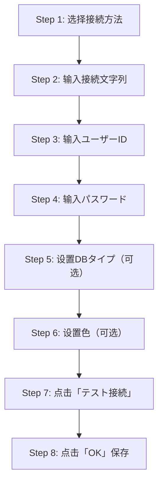

## 📌 目标
使用 **A5:SQL Mk-2** 通过 **直接接続（Easy Connect）** 方式连接 Oracle 数据库。

---

## 🔍 登录信息示例
- **用户ID**：`KH000`
- **密码**：`123456789`
- **连接字符串**：  
  ```
  //10.123.456.001:1521/KH00_PDB.dkcsub.tbinas.oraclevcn.com
  ```
- **端口**：`1521`
- **服务名**：`KH00_PDB.dkcsub.tbinas.oraclevcn.com`

---

## 🛠 操作流程（文字流程图）



---

## ✅ 详细步骤与输入值

### **Step 1：选择接続方法**
- 选中：
  ```
  直接接続（Oracle Client不要）
  ```

### **Step 2：输入接続文字列**
- 值：
  ```
  //10.123.456.001:1521/KH00_PDB.dkcsub.tbinas.oraclevcn.com
  ```
- 格式说明：
  ```
  //IP地址:端口/服务名
  ```

### **Step 3：输入ユーザーID**
- 值：
  ```
  KH022
  ```

### **Step 4：输入パスワード**
- 值：
  ```
  N30RJ1_jP_ez
  ```
- 可选：
  ```
  勾选「パスワードを保存する」
  ```

### **Step 5：DBタイプ（可选）**
- 如果是生产环境，勾选：
  ```
  本番環境
  ```

### **Step 6：色（可选）**
- 默认：
  ```
  (None)
  ```
- 可设置颜色用于区分环境。

### **Step 7：测试连接**
- 点击：
  ```
  テスト接続
  ```
- 确认连接成功。

### **Step 8：保存设置**
- 点击：
  ```
  OK
  ```

---

- path：\oracle\product\12.1.0\client_1\network\admin

- file：tnsnames.ora

- 追加内容：
  ```
  KH00_ABC=
    (DESCRIPTION=
      (LOAD_BALANCE = ON)
      (ADDRESS = (PROTOCOL=TCP)(HOST=10.123.456.101)(PORT=1521))
      (ADDRESS = (PROTOCOL=TCP)(HOST=10.123.456.102)(PORT=1521))
      (ADDRESS = (PROTOCOL=TCP)(HOST=10.123.456.103)(PORT=1521))
      (CONNECT_DATA=
        (SERVER=DEDICATED)
        (SERVICE_NAME=KH00_ABC.dkcsub.tbinas.oraclevcn.com)
        (FAILOVER_MODE=
          (TYPE=select)
          (METHOD=basic))))
  ```

---

## ⚠ 注意事项
- **必须选择「直接接続」**，否则需要 Oracle Client。
- **接続文字列必须加 `//` 前缀**。
- 确保 **网络可达**，端口 `1521` 未被防火墙阻挡。
- 如果连接失败，检查：
  - 服务名是否正确。
  - 用户名和密码是否正确。
  - 数据库是否允许远程连接。
