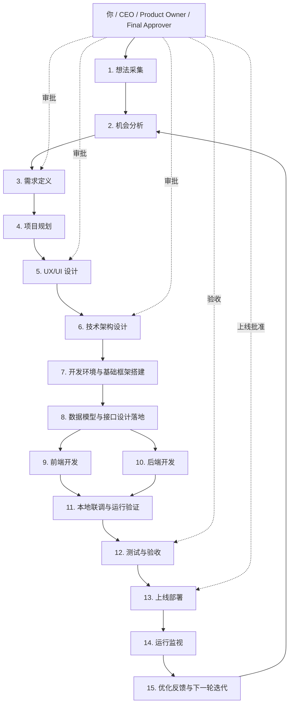
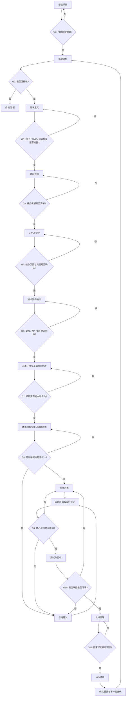

你（CEO / Product Owner）
│
├─ 战略/想法记录官
│   └─ ChatGPT + Notion AI
│
├─ 产品分析师
│   └─ ChatGPT + Claude
│
├─ 产品经理
│   └─ ChatGPT
│
├─ 项目规划师
│   └─ ChatGPT + Linear / Notion
│
├─ UX/UI 设计师
│   └─ Figma + Figma AI + v0
│
├─ 技术架构师
│   └─ Claude + ChatGPT
│
├─ 脚手架/基础工程师
│   └─ Cursor + GitHub Copilot
│
├─ 功能开发工程师
│   └─ Cursor + GitHub Copilot + VS Code
│
├─ 测试与验收工程师
│   └─ Claude + Playwright + Bruno
│
├─ 部署与运维工程师
│   └─ GitHub Actions + Vercel/Railway + ChatGPT
│
└─ 数据监控与优化分析师
    └─ Sentry + PostHog + ChatGPT


# 

## 0. 公司定位

**公司名称**：Personal AI Company  
**组织模式**：你 = CEO / Product Owner / Final Approver；AI = 固定岗位员工  
**目标**：从想法产生 → 需求成熟 → 设计 → 开发 → 测试 → 上线 → 监控 → 迭代，形成闭环

---

# 1. 组织架构

## 你
- CEO / Founder
- Product Owner
- Final Approver
- Quality Gate

## AI 岗位
1. 战略/想法记录官
2. 产品分析师
3. 产品经理
4. 项目规划师
5. UX/UI 设计师
6. 技术架构师
7. 脚手架/基础工程师
8. 功能开发工程师
9. 测试与验收工程师
10. 部署与运维工程师
11. 数据监控与优化分析师

---

# 2. 总流程

```text
想法采集
→ 机会分析
→ 需求定义
→ 项目规划
→ 设计输出
→ 技术架构
→ 基础框架搭建
→ 功能开发
→ 本地运行查看
→ 测试与验收
→ 上线部署
→ 运行监视
→ 优化反馈
→ 回到下一轮想法/需求
```

---

# 3. 阶段模板总表

| 阶段 | 负责人 | 输入 | 输出 | 验收标准 |
|---|---|---|---|---|
| 想法采集 | 战略/想法记录官 | 灵感、问题、用户反馈 | Idea Note, Problem Statement | 能清楚说明“谁的什么问题” |
| 机会分析 | 产品分析师 | Idea Note | Opportunity Brief | 有用户、场景、价值、风险 |
| 需求定义 | 产品经理 | Opportunity Brief | PRD, User Stories, Acceptance Criteria | 范围清晰、可验收 |
| 项目规划 | 项目规划师 | PRD | Task Breakdown, Milestones | 可执行、优先级明确 |
| 设计输出 | UX/UI 设计师 | PRD, 流程 | Wireframe, Mockup, Flow | 核心流程可视化 |
| 技术架构 | 技术架构师 | PRD, Design | Architecture, DB, API | 方案清晰、可实现 |
| 基础框架搭建 | 脚手架工程师 | Architecture | 初始仓库、README、环境模板 | 项目可启动 |
| 功能开发 | 功能开发工程师 | PRD, Design, API | 功能代码、测试草稿、PR | 功能可运行 |
| 本地运行查看 | 你 + 开发工程师 | 功能代码 | Demo、问题清单 | 核心流程跑通 |
| 测试与验收 | 测试工程师 | 功能代码、验收标准 | Test Plan, Bug Report, UAT | 高优问题清零 |
| 上线部署 | 运维工程师 | 通过测试的版本 | 部署记录、回滚方案、线上地址 | 线上可访问 |
| 运行监视 | 监控分析师 | 线上系统 | Error Report, Usage Report | 能发现问题与机会 |

---

# 4. 标准项目目录模板

你可以给每个项目都用这一套目录：

```text
/project-name
├─ docs
│  ├─ 01-idea.md
│  ├─ 02-opportunity-brief.md
│  ├─ 03-prd.md
│  ├─ 04-project-plan.md
│  ├─ 05-wireframe-notes.md
│  ├─ 06-architecture.md
│  ├─ 07-api-spec.md
│  ├─ 08-test-plan.md
│  ├─ 09-deployment.md
│  └─ 10-optimization-log.md
├─ frontend
├─ backend
├─ infra
├─ tests
└─ README.md
```

---

# 5. 各阶段可复制模板

## 模板 1：Idea Note

```markdown
# Idea Note

## 想法名称
[填写]

## 一句话描述
[一句话说清这个想法]

## 发现的问题
[用户遇到了什么问题]

## 目标用户
[谁会用]

## 为什么值得做
[价值在哪里]

## 可能风险
[有哪些不确定性]

## 下一步建议
[进入分析 / 暂缓 / 放弃]
```

---

## 模板 2：Opportunity Brief

```markdown
# Opportunity Brief

## 背景
[这个机会从哪里来]

## 用户是谁
[目标用户]

## 场景是什么
[用户在什么情况下会遇到这个问题]

## 当前痛点
[现在最麻烦的点]

## 现有替代方案
[竞品或现有解决方式]

## 我们的机会点
[为什么我们值得做]

## 风险分析
- 市场风险：
- 技术风险：
- 执行风险：

## 结论
[值得推进 / 暂缓 / 放弃]
```

---

## 模板 3：PRD

```markdown
# PRD

## 1. 项目背景
[为什么做]

## 2. 项目目标
[希望达成什么]

## 3. 用户画像
[目标用户是谁]

## 4. 核心场景
[用户如何使用]

## 5. 功能需求
### 5.1 功能 A
- 描述：
- 输入：
- 输出：

### 5.2 功能 B
- 描述：
- 输入：
- 输出：

## 6. 非功能需求
- 性能：
- 安全：
- 可用性：

## 7. MVP 范围
[这次只做什么]

## 8. 验收标准
- [ ] 条件1
- [ ] 条件2
- [ ] 条件3

## 9. 风险与待确认项
- [ ]
```

---

## 模板 4：Project Plan

```markdown
# Project Plan

## 项目名称
[填写]

## 当前阶段
[需求 / 设计 / 开发 / 测试 / 上线]

## 里程碑
- M1:
- M2:
- M3:

## 任务拆解
- [ ] Task 1
- [ ] Task 2
- [ ] Task 3

## 优先级
- P0:
- P1:
- P2:

## 风险与阻塞
- [ ]

## 下一阶段进入条件
- [ ]
```

---

## 模板 5：Design Brief

```markdown
# Design Brief

## 页面/模块名称
[填写]

## 页面目标
[这个页面要解决什么]

## 用户任务
[用户在这个页面要完成什么]

## 关键流程
1.
2.
3.

## 设计要求
- 风格：
- 重点内容：
- 交互要求：

## 输出要求
- Wireframe
- Mockup
- Flow Diagram
```

---

## 模板 6：Architecture Doc

```markdown
# Architecture Doc

## 技术栈
- Frontend:
- Backend:
- Database:
- Deployment:

## 模块划分
- 模块 1：
- 模块 2：
- 模块 3：

## 数据模型
- Entity A:
- Entity B:

## API 设计
- GET /...
- POST /...
- PUT /...
- DELETE /...

## 权限设计
[谁可以做什么]

## 部署方式
[本地 / 测试 / 正式]

## 风险与取舍
- [ ]
```

---

## 模板 7：Development Record

```markdown
# Development Record

## 功能名称
[填写]

## 关联需求
[PRD 链接/章节]

## 关联设计
[设计稿链接]

## 实现内容
- [ ]
- [ ]
- [ ]

## 本地运行结果
[是否启动成功 / 效果说明]

## 已知问题
- [ ]

## 下一步
- [ ]
```

---

## 模板 8：Test Plan

```markdown
# Test Plan

## 测试对象
[功能/模块]

## 测试范围
[包含哪些]

## 测试类型
- 单元测试
- 集成测试
- E2E
- 手工验收

## 测试用例
### 用例 1
- 步骤：
- 预期结果：

### 用例 2
- 步骤：
- 预期结果：

## Bug 记录
- [ ]

## 验收结果
[通过 / 不通过]
```

---

## 模板 9：Deployment Record

```markdown
# Deployment Record

## 发布版本
[版本号]

## 发布内容
[这次上线了什么]

## 部署环境
[Staging / Production]

## 环境变量
- [ ]

## 部署步骤
1.
2.
3.

## 回滚方案
1.
2.

## 上线后验证
- [ ] 首页正常
- [ ] 核心功能正常
- [ ] API 正常

## 问题记录
- [ ]
```

---

## 模板 10：Optimization Log

```markdown
# Optimization Log

## 来源
[Sentry / PostHog / 用户反馈 / 自己观察]

## 发现的问题或机会
[填写]

## 影响范围
[大 / 中 / 小]

## 可能原因
[填写]

## 建议动作
- [ ]

## 是否进入需求池
[是 / 否]

## 下一步负责人
[岗位]
```

---

# 6. 每个岗位的 AI 配置模板

## 战略/想法记录官
- AI：ChatGPT
- 工具：Notion
- 任务：整理灵感、生成问题陈述

## 产品分析师
- AI：ChatGPT + Claude
- 任务：用户分析、场景分析、机会判断

## 产品经理
- AI：ChatGPT
- 任务：PRD、用户故事、验收标准

## 项目规划师
- AI：ChatGPT
- 工具：Notion / Linear
- 任务：里程碑、任务拆解、优先级

## UX/UI 设计师
- AI / 工具：Figma + v0
- 任务：线框图、设计稿、流程图

## 技术架构师
- AI：Claude + ChatGPT
- 任务：技术方案、API、DB 设计

## 脚手架工程师
- AI：Cursor + Copilot
- 任务：项目初始化、基础结构

## 功能开发工程师
- AI：Cursor + Copilot
- 工具：VS Code
- 任务：功能代码、测试草稿

## 测试与验收工程师
- AI：Claude
- 工具：Playwright / Bruno
- 任务：测试用例、验收、Bug 记录

## 部署与运维工程师
- AI：ChatGPT / Claude
- 工具：GitHub Actions / Vercel / Railway
- 任务：部署、回滚、环境配置

## 数据监控与优化分析师
- 工具：Sentry / PostHog
- AI：ChatGPT
- 任务：监控错误、分析使用、输出优化项

---

# 7. 每日运行模板

```markdown
# Daily Operating Sheet

## 今日目标
- [ ]

## 当前阶段
[填写]

## 今日待 AI 完成事项
- [ ]
- [ ]
- [ ]

## 今日待我审批事项
- [ ]
- [ ]

## 当前阻塞
- [ ]

## 今日结论
- [继续推进 / 打回修改 / 进入下一阶段]

## 明日第一优先级
- [ ]
```

---

# 8. 每周复盘模板

```markdown
# Weekly Review

## 本周完成
- [ ]

## 本周上线
- [ ]

## 本周出现的问题
- [ ]

## 本周关键数据变化
- [ ]

## 下周优先事项
- [ ]

## 需要优化的工作流
- [ ]
```

---

# 9. 阶段闸门模板

```markdown
# Stage Gate Check

## 当前阶段
[填写]

## 必备交付物
- [ ] 文档已完成
- [ ] 输出已评审
- [ ] 风险已记录
- [ ] 下一阶段输入已准备

## 是否通过
[通过 / 不通过]

## 不通过原因
[填写]

## 下一步动作
[填写]
```

---

# 10. 最小可行执行方式

如果你现在就想开始，不要一次全上。

## 第一阶段只用这几个模板：
- Idea Note
- Opportunity Brief
- PRD
- Project Plan
- Development Record
- Test Plan
- Deployment Record
- Optimization Log

这样已经够跑完整闭环了。

---

# 11. 一句话使用说明

这套模板的使用方式就是：

1. **先写 Idea Note**
2. **做 Opportunity Brief**
3. **确认后写 PRD**
4. **拆 Project Plan**
5. **出 Design + Architecture**
6. **开发记录写进 Development Record**
7. **测试写进 Test Plan**
8. **上线写 Deployment Record**
9. **运行后写 Optimization Log**
10. **把优化项重新放回想法池，开始下一轮**

---

# 12. 最终一句话

这套模板的本质是：

## **把你个人的产品研发过程，做成一间由你领导、由 AI 执行、由流程驱动、由数据回流的“个人 AI 公司”。**

3，
# 个人 AI 公司工作流程图（开发类项目专用版）

## 0. 文档说明

本文件用于定义一套适用于**开发类项目**的“个人 AI 公司”工作流。  
目标是将从想法产生到上线监控的全过程，拆成固定节点，并为每个节点明确：

- 输入
- 输出
- 工具
- AI 员工
- 阶段闸门
- 与下一阶段的交接关系

你的角色是：

- CEO / Founder
- Product Owner
- Final Approver
- Quality Gate

AI 承担各专业岗位的执行工作，你负责方向、审批、取舍和最终验收。

---

# 1. 总体开发闭环流程图



---

# 2. 开发类项目专用版阶段说明总表

| 节点 | 名称 | 目标 |
|---|---|---|
| 1 | 想法采集 | 把灵感变成可分析的问题 |
| 2 | 机会分析 | 判断是否值得做 |
| 3 | 需求定义 | 把问题转成可执行需求 |
| 4 | 项目规划 | 把需求拆成任务与里程碑 |
| 5 | UX/UI 设计 | 输出页面与交互方案 |
| 6 | 技术架构设计 | 明确技术栈、模块、边界 |
| 7 | 开发环境与基础框架搭建 | 初始化仓库和可运行基础工程 |
| 8 | 数据模型与接口设计落地 | 明确数据库、DTO、API 契约 |
| 9 | 前端开发 | 实现页面、交互、状态管理 |
| 10 | 后端开发 | 实现 API、服务、数据访问、权限 |
| 11 | 本地联调与运行验证 | 本地实际跑通核心业务流程 |
| 12 | 测试与验收 | 保证质量，完成 UAT |
| 13 | 上线部署 | 将版本部署到测试/生产环境 |
| 14 | 运行监视 | 收集错误、性能、用户行为数据 |
| 15 | 优化反馈与下一轮迭代 | 用真实数据进入下一轮需求 |

---

# 3. 节点详细说明

---

## 1. 想法采集

### 目标
把零散灵感、用户抱怨、业务设想整理成可分析的问题。

### 输入
- 你的灵感
- 用户反馈
- 市场观察
- 竞品启发
- 当前业务痛点

### 输出
- `Idea Note`
- `Problem Statement`
- `Value Hypothesis`

### 工具
- Notion
- Obsidian（可选）
- ChatGPT

### AI 员工
- 战略/想法记录官
- 推荐 AI：**ChatGPT**

### 交接给
- 机会分析

### 阶段闸门
- 是否能明确说清楚：**谁遇到了什么问题，为什么值得解决**

---

## 2. 机会分析

### 目标
判断这件事是否值得投入时间和资源。

### 输入
- Idea Note
- Problem Statement

### 输出
- `Opportunity Brief`
- 用户画像
- 使用场景说明
- 竞品分析摘要
- 风险清单

### 工具
- ChatGPT
- Claude
- Notion

### AI 员工
- 产品分析师
- 推荐 AI：**ChatGPT + Claude**

### 交接给
- 需求定义

### 阶段闸门
- 是否明确：
  - 用户是谁
  - 场景是什么
  - 价值是什么
  - 风险是什么
  - 是否值得推进

---

## 3. 需求定义

### 目标
把“值得做”转成“可执行需求”。

### 输入
- Opportunity Brief
- 用户画像
- 场景说明

### 输出
- `PRD.md`
- `User Stories`
- `Acceptance Criteria`
- `MVP Scope`

### 工具
- ChatGPT
- Notion

### AI 员工
- 产品经理
- 推荐 AI：**ChatGPT**

### 交接给
- 项目规划
- UX/UI 设计
- 技术架构设计

### 阶段闸门
- PRD 是否完整
- MVP 范围是否清晰
- 验收标准是否可测试

---

## 4. 项目规划

### 目标
把需求变成可执行的任务列表和里程碑。

### 输入
- PRD
- MVP Scope
- 验收标准

### 输出
- `Project Plan`
- `Task Breakdown`
- `Milestone Plan`
- `Priority Plan`

### 工具
- Notion
- Linear（可选）
- ChatGPT

### AI 员工
- 项目规划师
- 推荐 AI：**ChatGPT**

### 交接给
- 设计
- 架构
- 开发执行

### 阶段闸门
- 是否已经拆分为可执行任务
- 是否有优先级
- 是否有依赖关系和阶段目标

---

## 5. UX/UI 设计

### 目标
把需求转成页面、流程和交互方案。

### 输入
- PRD
- 核心用户流程
- 品牌风格偏好
- 关键场景

### 输出
- `Wireframe`
- `UI Mockup`
- `Flow Diagram`
- 页面说明

### 工具
- Figma
- Figma AI
- v0（可选）
- Whimsical（可选）

### AI 员工
- UX/UI 设计师
- 推荐 AI / 工具：**Figma + Figma AI + v0**

### 交接给
- 技术架构设计
- 前端开发

### 阶段闸门
- 核心页面是否齐全
- 用户主流程是否明确
- 页面结构是否可交付开发

---

## 6. 技术架构设计

### 目标
确定如何实现产品。

### 输入
- PRD
- UI 设计稿
- 用户流程图
- MVP 范围

### 输出
- `Architecture.md`
- `DB Schema`
- `API Spec`
- `Tech Stack Decision`
- 模块划分说明

### 工具
- Claude
- ChatGPT
- Markdown 文档
- draw.io / Mermaid（可选）

### AI 员工
- 技术架构师
- 推荐 AI：**Claude + ChatGPT**

### 交接给
- 开发环境与基础框架搭建
- 数据模型与接口设计落地
- 前后端开发

### 阶段闸门
- 技术栈是否明确
- 模块边界是否清晰
- 数据结构是否明确
- 接口契约是否明确

---

## 7. 开发环境与基础框架搭建

### 目标
初始化一个可运行的工程基础。

### 输入
- Architecture.md
- Tech Stack Decision
- 项目目录约定

### 输出
- 初始仓库
- `README.md`
- `.env.example`
- 前后端基础目录
- 基础依赖配置
- Docker / CI 初版（可选）

### 工具
- VS Code
- Cursor
- GitHub Copilot
- GitHub
- Docker

### AI 员工
- 脚手架/基础工程师
- 推荐 AI：**Cursor + GitHub Copilot**

### 交接给
- 数据模型与接口设计落地
- 前后端开发

### 阶段闸门
- 本地是否能成功启动基础工程
- README 是否能指导运行
- 仓库结构是否清晰

---

## 8. 数据模型与接口设计落地

### 目标
把架构设计真正落成开发契约。

### 输入
- DB Schema
- API Spec
- Architecture.md
- PRD

### 输出
- 实体定义
- DTO / Request / Response 结构
- OpenAPI / Swagger 草稿
- 数据库迁移脚本草稿
- 接口文档

### 工具
- Claude
- ChatGPT
- Cursor
- Copilot
- 数据库设计工具

### AI 员工
- 技术架构师
- 脚手架工程师
- 推荐 AI：**Claude + Cursor + Copilot**

### 交接给
- 前端开发
- 后端开发

### 阶段闸门
- 前后端是否能基于同一接口契约工作
- 数据模型是否支撑业务需求
- 字段命名和结构是否统一

---

## 9. 前端开发

### 目标
实现界面、交互和前端状态逻辑。

### 输入
- UI Mockup
- Flow Diagram
- API Spec
- 前端基础工程

### 输出
- 页面代码
- 组件代码
- 状态管理逻辑
- 表单处理逻辑
- 前端测试草稿

### 工具
- VS Code
- Cursor
- Copilot
- v0（可选）
- 浏览器 DevTools

### AI 员工
- 功能开发工程师（前端）
- 推荐 AI：**Cursor + Copilot**

### 交接给
- 本地联调与运行验证

### 阶段闸门
- 页面是否能正常打开
- 核心交互是否可用
- 是否符合设计稿主流程

---

## 10. 后端开发

### 目标
实现业务逻辑、接口、数据访问和权限控制。

### 输入
- API Spec
- DB Schema
- 后端基础工程
- PRD
- 验收标准

### 输出
- Controller / Route
- Service
- Repository / DAO
- 权限逻辑
- 单元测试草稿
- Swagger / OpenAPI 更新

### 工具
- VS Code / IntelliJ（可选）
- Cursor
- Copilot
- 数据库工具
- Bruno / Postman

### AI 员工
- 功能开发工程师（后端）
- 推荐 AI：**Cursor + Copilot**
- 如果是复杂 Java 项目可补：**IntelliJ IDEA**

### 交接给
- 本地联调与运行验证

### 阶段闸门
- API 是否可访问
- 业务逻辑是否跑通
- 数据是否能正确落库/读取
- 基础异常处理是否存在

---

## 11. 本地联调与运行验证

### 目标
把前后端接起来，在本地跑通核心业务流程。

### 输入
- 前端代码
- 后端代码
- 数据模型
- 测试数据
- 环境变量配置

### 输出
- 本地可运行系统
- Demo 截图 / Demo 录屏
- 联调问题清单
- 修复清单

### 工具
- VS Code
- Docker
- 本地数据库
- Bruno / Postman
- 浏览器

### AI 员工
- 功能开发工程师
- 你（最终体验确认）
- 推荐 AI：**Cursor + Copilot + ChatGPT**

### 交接给
- 测试与验收

### 阶段闸门
- 核心业务路径是否跑通
- 页面/API 是否联调成功
- 是否存在阻断级问题

---

## 12. 测试与验收

### 目标
确保系统达到可交付标准。

### 输入
- 可运行版本
- Acceptance Criteria
- 本地联调结果
- 关键路径列表

### 输出
- `Test Plan`
- `Test Cases`
- `Bug Report`
- `UAT Checklist`
- 验收结论

### 工具
- Claude
- Playwright
- Bruno / Postman
- JUnit / Mockito / Vitest / Jest（视技术栈）

### AI 员工
- 测试与验收工程师
- 推荐 AI：**Claude**
- 推荐测试工具：**Playwright + Bruno**

### 交接给
- 上线部署

### 阶段闸门
- P0/P1 缺陷是否清零
- 核心流程是否通过 UAT
- 是否达到上线标准

---

## 13. 上线部署

### 目标
把通过验收的系统部署到线上环境。

### 输入
- 通过测试的版本
- 部署说明
- 环境变量
- 回滚方案

### 输出
- `Deployment Record`
- 上线地址
- 部署日志
- 回滚预案
- 发布说明

### 工具
- GitHub Actions
- Vercel / Railway / Render
- Docker
- ChatGPT / Claude

### AI 员工
- 部署与运维工程师
- 推荐 AI / 工具：**GitHub Actions + Vercel/Railway + ChatGPT**

### 交接给
- 运行监视

### 阶段闸门
- 部署是否成功
- 线上是否可访问
- 是否具备回滚能力
- 关键监控是否接入

---

## 14. 运行监视

### 目标
持续观察线上稳定性和用户使用情况。

### 输入
- 线上系统
- 真实用户访问
- 错误日志
- 行为数据

### 输出
- `Error Report`
- `Usage Report`
- 性能问题摘要
- 转化/流失观察
- 优化机会清单

### 工具
- Sentry
- PostHog
- 日志平台
- ChatGPT / Claude

### AI 员工
- 数据监控与优化分析师
- 推荐工具：**Sentry + PostHog**
- 推荐 AI：**ChatGPT**

### 交接给
- 优化反馈与下一轮迭代

### 阶段闸门
- 是否已经收集到足够的错误和行为数据
- 是否能够明确指出当前问题和优化方向

---

## 15. 优化反馈与下一轮迭代

### 目标
把真实运行反馈转成新的需求输入。

### 输入
- Error Report
- Usage Report
- 用户反馈
- 你的业务判断

### 输出
- `Optimization Backlog`
- 新的 Idea Note
- 新的需求优先级调整
- 下一轮项目计划建议

### 工具
- Notion
- ChatGPT
- Claude

### AI 员工
- 数据监控与优化分析师
- 产品分析师
- 产品经理

### 交接给
- 机会分析
- 需求定义

### 阶段闸门
- 是否已经形成明确的下一轮优化主题
- 是否知道应该优先解决什么问题

---

# 4. 开发类项目专用阶段闸门图



---

# 5. 推荐工具总表

| 职能 | 推荐工具 | 推荐 AI |
|---|---|---|
| 想法管理 | Notion | ChatGPT |
| 分析与需求 | Notion | ChatGPT + Claude |
| 设计 | Figma, v0 | Figma AI |
| 架构 | Markdown, Mermaid | Claude + ChatGPT |
| 编码 | VS Code, Cursor, Copilot | Cursor + Copilot |
| Java 深度开发（可选） | IntelliJ IDEA | Copilot |
| API 调试 | Bruno / Postman | ChatGPT / Claude |
| 本地运行 | Docker | ChatGPT |
| 测试 | Playwright, JUnit, Bruno | Claude |
| 代码托管 | GitHub | Copilot |
| 自动部署 | GitHub Actions, Vercel, Railway | ChatGPT |
| 监控 | Sentry, PostHog | ChatGPT |

---

# 6. 你的职责边界

你不负责每个岗位的细节执行。  
你负责的是：

1. 决定做什么
2. 决定先做什么
3. 审批关键交付物
4. 决定是否进入下一阶段
5. 决定是否上线
6. 基于监控结果决定下一轮迭代方向

也就是说：

- **AI 负责执行**
- **流程负责约束**
- **你负责拍板**

---

# 7. 最终总结

这套“个人 AI 公司开发类项目工作流”的核心，是把软件项目拆成明确的节点，并给每个节点配置：

- 固定输入
- 固定输出
- 固定工具
- 固定 AI 员工
- 固定阶段闸门

最终形成：

**想法 → 需求 → 设计 → 架构 → 搭建 → 开发 → 联调 → 测试 → 部署 → 监控 → 优化 → 下一轮迭代**

的完整闭环。


------------------------------------------------------------------------

# 个人 AI 公司工作流程简介

这套流程的意思很简单：

## 我来负责想法和判断，AI 来分工做事

整个流程就是把一个产品从“想到”一步步变成“能上线、能运行、能继续优化”的过程。

---

# 整个流程可以理解成 8 步

## 1. 想清楚要做什么

先把一个想法整理清楚：

- 这个产品是给谁用的
- 它解决什么问题
- 为什么值得做

这一步相当于先确认方向，不是想到什么就直接开发。

---

## 2. 定义最小版本

不是一开始就做很大，而是先确定：

- 第一版最少要做哪些功能
- 哪些功能现在必须有
- 哪些以后再加

这样可以避免项目一开始就太复杂。

---

## 3. 设计页面和技术方案

这一步主要做两件事：

- 先想清楚页面大概长什么样
- 再想清楚程序怎么实现

也就是把“想法”变成“可执行方案”。

---

## 4. 搭建项目基础框架

相当于先把房子的地基搭起来：

- 创建项目
- 建好前端和后端基础结构
- 让项目可以先跑起来

这样后面加功能才有地方放。

---

## 5. 开发核心功能

这一步开始真正做产品的主要能力，比如：

- 注册登录
- 核心业务功能
- 数据保存和读取
- 最基本的权限控制

重点不是做很多功能，而是先把最关键的功能做出来。

---

## 6. 本地运行检查效果

把做出来的东西先在自己电脑上跑起来，看：

- 能不能正常打开
- 功能能不能正常使用
- 用户最主要的操作流程能不能走通

这一步是先自己验收一遍。

---

## 7. 测试并上线

确认没有大问题之后，就把项目部署到线上。

也就是说：

- 别人可以通过网址访问
- 产品真正进入可使用状态

这一步相当于正式发布。

---

## 8. 上线后继续观察和优化

产品上线不是结束，而是开始。

上线后要继续看：

- 有没有报错
- 用户有没有真的在用
- 用户会卡在哪一步
- 下一步最应该改什么

然后根据这些反馈，再进入下一轮更新。

---

# 这套流程的核心特点

## 1. 人负责方向，AI 负责执行

我不让 AI 完全自己决定产品方向，而是：

- 我决定做什么
- AI 帮我分析、设计、开发、测试、部署

---

## 2. 先做最小版本

不是一开始就做很复杂的大系统，而是先做一个最小可用版本，尽快上线验证。

---

## 3. 做成闭环

这不是只做到“开发完”就结束，而是做到：

**想法 → 开发 → 上线 → 观察 → 优化 → 再继续做**

这样项目就能持续进化。

---

# 一句话总结

## 这套工作流就是：我负责做决定，AI 负责分工执行，把一个产品从想法一步步做到上线，再根据真实使用情况继续优化。


-----------------------------------------------------------------------------------------------------

# 从想法产生到项目上线的流程概括

1. **想法产生**：先记录一个值得做的产品想法，并明确它想解决什么问题。  
2. **价值判断**：判断这个想法是否真的有用户需求和实际价值。  
3. **确定最小版本**：先定义第一版最少必须实现哪些核心功能。  
4. **需求整理**：把想法整理成清晰的功能需求和使用流程。  
5. **项目规划**：把需求拆成可执行的任务，并安排先后顺序。  
6. **页面设计**：设计产品页面结构、界面布局和用户操作流程。  
7. **技术方案设计**：确定项目要用什么技术，以及系统要怎么实现。  
8. **项目搭建**：先把前端、后端和基础环境搭建起来，让项目能启动。  
9. **功能开发**：按照需求逐步把核心功能写出来。  
10. **本地运行**：在本地电脑上把项目跑起来，检查功能和页面效果。  
11. **联调修正**：把前后端连接起来，修复运行中发现的问题。  
12. **测试验收**：检查项目是否稳定可用，确认它达到预期目标。  
13. **上线部署**：把项目发布到线上服务器，让用户可以正式访问。  
14. **上线观察**：查看项目上线后的运行情况和用户使用反馈。  
15. **持续优化**：根据错误、反馈和数据继续改进产品，进入下一轮迭代。